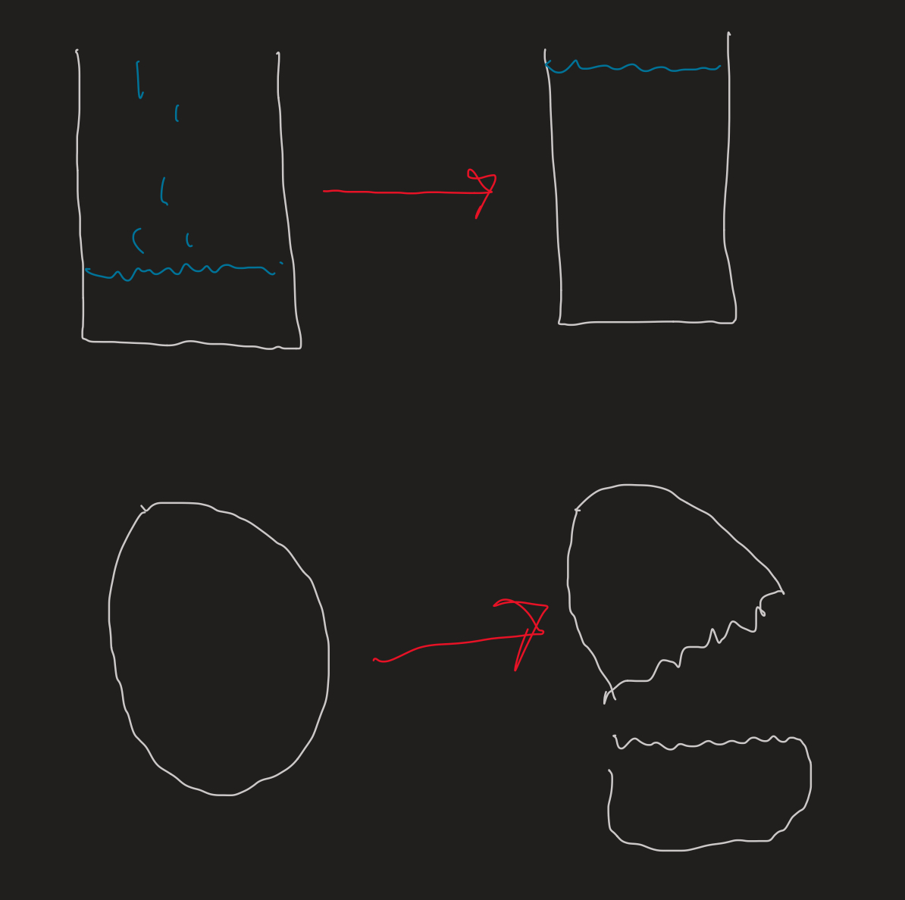
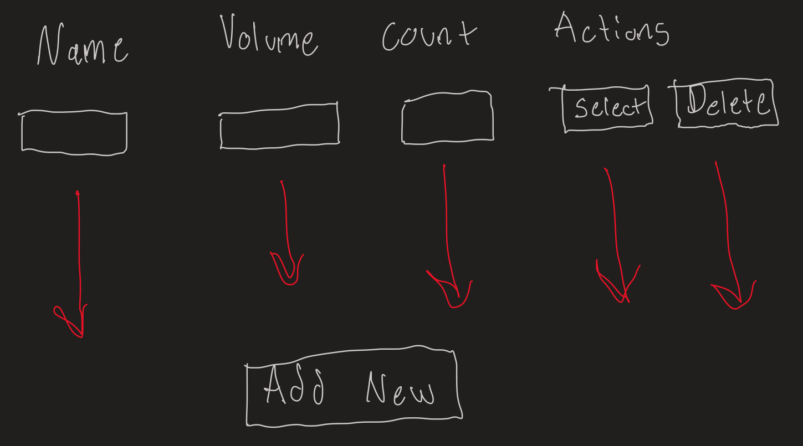
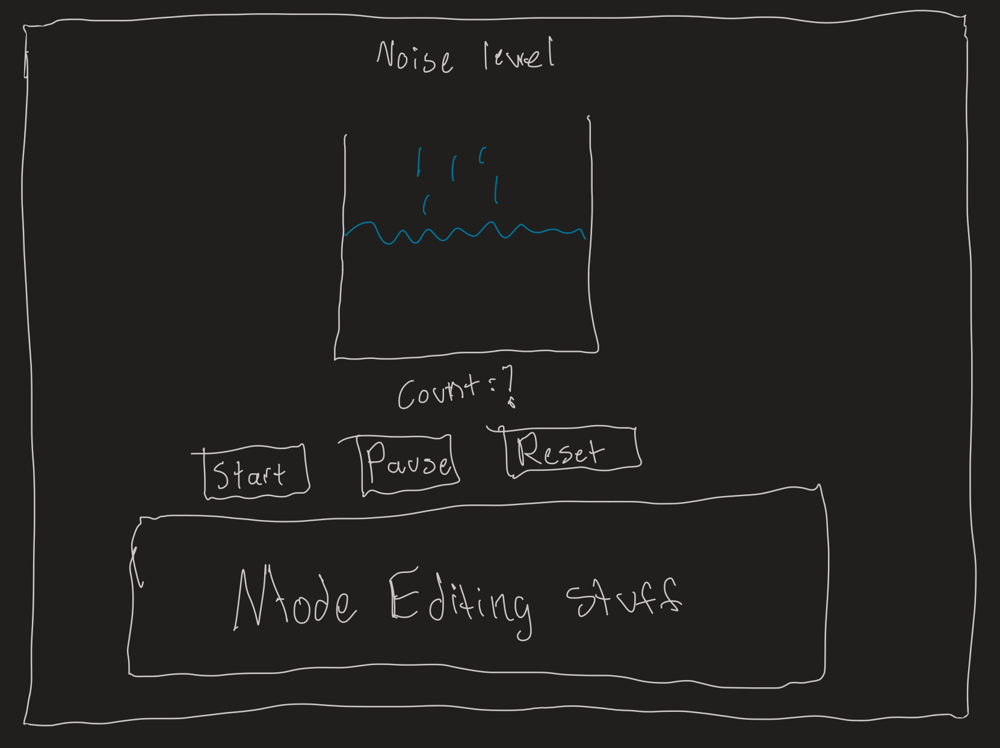
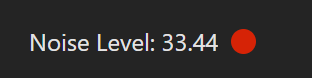
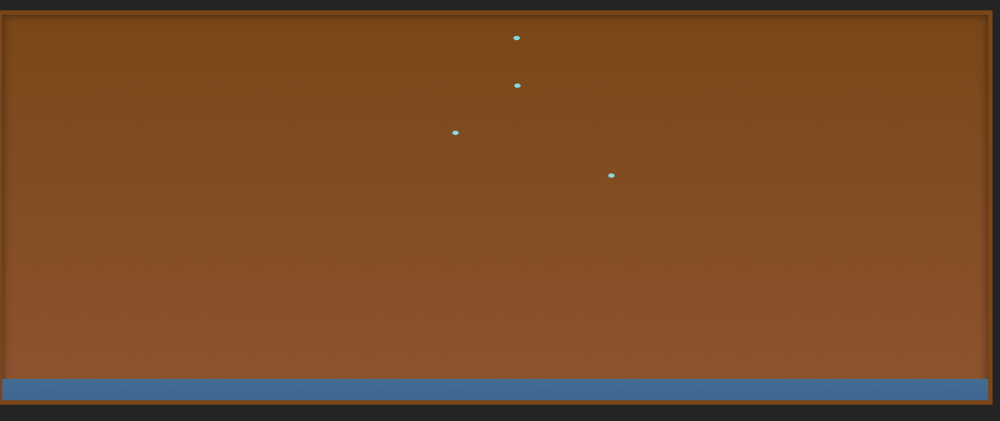
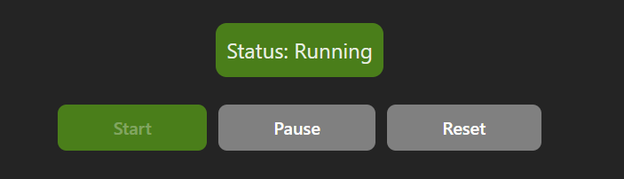
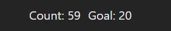
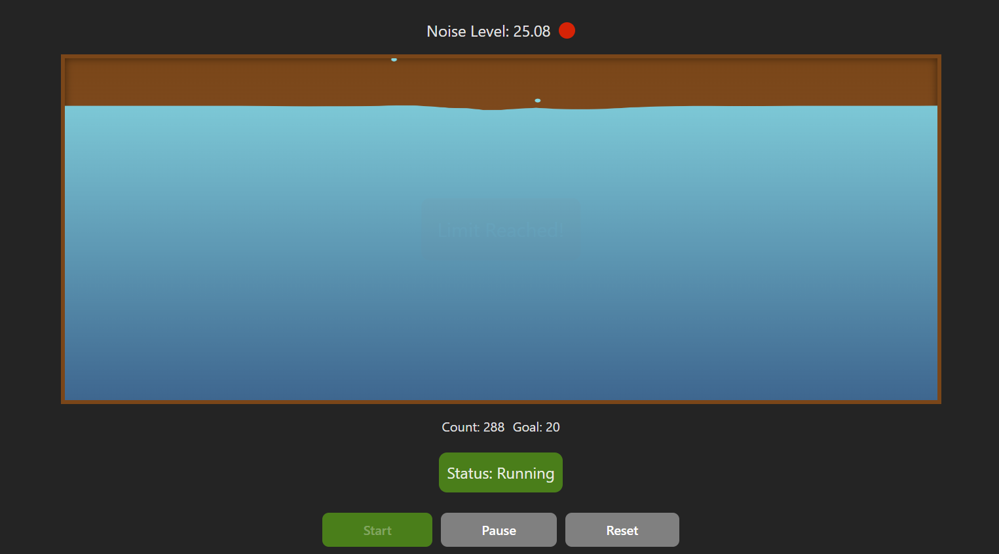
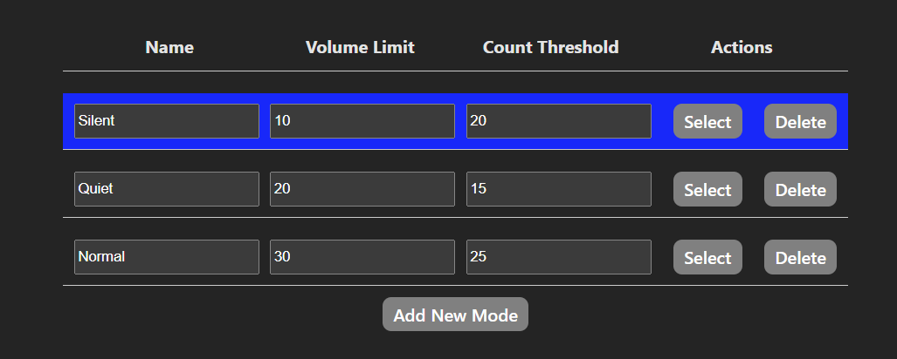

# User_Interface_Project_4
This website only works on google chrome right now. I have tested on firefox and it doesn't work. 

## Link to Source Code 
https://github.com/NSuer/User_Interface_Project_4

## Link to Hosted Website
https://nsuer.github.io/User_Interface_Project_4/

## Documentation

### Description of the Problem: Classroom Noise Management and Focus  
Education is one of the world's biggest Issues. In this digital age, teaching is becoming harder due to decreasing attention spans and increasing distractions. A small part of this is classroom management, which involves keeping students focused and maintaining order so everyone can learn.

Noise management is an important yet often overlooked part of creating an effective learning environment. In many classrooms, it can be hard for students to focus because of the noise level. Too much talking, moving around, and distractions can make it difficult to pay attention and get work done. Teachers often struggle to keep the noise level down, especially in larger classrooms where it's easy for students to get distracted or not follow rules. This leads to an unproductive learning environment, where both teachers and students are frustrated by the noise. The problem here is that managing classroom noise is hard to do in real-time. It's not just about telling students to be quiet but finding a way to remind them of the noise level and make them more aware of how loud it is. A solution to this would be to focus on creating a system that can track noise levels and show students when they're getting too loud, encouraging them to be quieter.

A user interface (UI) can help by giving real-time feedback on noise levels in the classroom. Using a microphone, the system can measure the noise and display it as drops of water falling into a bucket. Each time the noise gets too loud, a drop falls, and when the bucket fills up, the system gives a "Limit Reached" alert. This lets both students and teachers know that the noise level is too high.Teachers can adjust the settings to fit their needs. For example, they can set different noise levels for different times, like a lower noise threshold during tests or a higher one during group work. This makes it easier for teachers to manage the classroom without constantly telling students to be quiet. The visual aspect of the UI makes it more fun and interactive for students, and it encourages them to keep the noise under control without feeling like they are being punished.

#### Design Sketches to develop and illustrate my ideas
- Real-time Noise Visualization: 
  - Drops fall into a bucket when noise levels exceed a threshold.
  - Egg cracks when noise levels exceed a threshold.

- Customizable Modes: Teachers can adjust volume limits and thresholds via an intuitive interface.

- Overall design 

### Description of the Project
This project, a Classroom Noise Monitoring System, aims to help teachers manage classroom noise levels using real-time feedback. It functions by detecting noise levels through a microphone and visually representing the noise as water drops falling into a bucket. After a count threshold is reached, which is how many times the students were too loud, a "Limit Reached" alert is triggered, letting the teacher know they need to punish their students or remind them that they're being too loud.

Teachers can select different modes—Silent, Quiet, and Normal or create custom modes, adjusting noise tolerance and the number of drops required to trigger the alert. This system supports classroom management by turning noise monitoring into a visual and interactive experience, making it easier for students to understand and follow noise expectations.

### Description of the Interface in Detail
The interface consists of two primary components: Real-time Noise Monitoring and Mode Management.

- Real-time Noise Monitoring Interface:
  - The visual bucket and alert system provide immediate feedback to students, encouraging self-regulation. The interactive nature of the drops falling into a bucket makes noise management engaging and intuitive.
  - Noise Level Display:
    - Located at the top of the interface, this displays the current noise level in decibels. A dynamic indicator (red light) shows whether the current noise exceeds the set threshold.
    - 
  - Bucket Animation:
    - The bucket fills with drops each time the noise level exceeds the limit. This visually represents the accumulation of noise over time. The goal counter below tracks progress toward the limit.
    - 
  - Status and Control Buttons:
    - Start, Pause, Reset: These buttons control the monitoring process.
      - Start: Begins noise tracking and drop accumulation.
      - Pause: Halts the monitoring without resetting the progress.
      - Reset: Clears the bucket and restarts the monitoring process.
    - 
  - Progress Display:
    - A count tracker shows how many drops have fallen into the bucket and how many are needed to reach the set goal (e.g., "Count: 12 Goal: 20").
    - 

- Mode Management Interface:
  - Teachers can fine-tune the system to suit different classroom activities. For example:
    - Silent Mode: For exams, with strict noise limits.
    - Normal Mode: For group activities, with higher tolerance.
  - Mode Table:
    - This table lists the available modes: Silent, Quiet, and Normal. Each mode has configurable settings:
      - Name: The mode name.
      - Volume Limit: The maximum allowed decibel level for each mode.
      - Count Threshold: The number of drops required to trigger the "Limit Reached" alert.
  - Actions:
    - Select Button: Allows the teacher to activate a specific mode.
    - Delete Button: Removes a mode from the list (excluding default modes).
  - Add New Mode:
    - Teachers can create custom modes by specifying a name, volume limit, and count threshold, then saving it for future use.

### Implementation:
I implemented this application using Vite, Svelte, and TypeScript. The main thing I leveraged was Svelte, I made use of stores and reactive variables to manage state across different components. Stores allowed me to share data, like noise levels and drop counts, between components efficiently, while reactive variables ensured that the UI updated automatically whenever the data changed. This was useful for features like real-time noise monitoring and visual feedback in the form of falling water drops.

For the water bucket visualization, I integrated a 2D water simulation originally created by Christopher Yann Moussaba ([available on CodePen](https://codepen.io/ymoussaba/pen/jRXrGq)). The simulation provided a visually engaging way to represent noise levels as water drops filling a bucket. However, to make it work with Svelte and my application's logic, I had to make a ton of modifications. These included:
- Adapting the simulation for reactive updates: I connected the water drop animations to Svelte reactive variables, ensuring that drops only appeared when the noise threshold was exceeded.
- Adding controls for pausing and resetting: The original simulation didn't support pausing or resetting, so I implemented these features by modifying the code to listen for events triggered by Svelte reactive variables.
- Customizing the design: I updated the simulation's visuals to be inside the bucket and added logic to dynamically adjust the water level based on noise input.

Overall, the combination of Svelte's reactivity and the water simulation provided an interactive and engaging way to give students real-time feedback on their noise levels, making classroom management more effective and fun.

## AI Use 
- I used chat gpt with the prompt "Using Vite and svelte, Make a website that uses the computer's mic to change an indicator from green to red based on the noise level of the environment." to make a very basic form of my webpage. It was useful in getting the mic working and connected but is no where close to my final website. It really only gave me a decibel reading and a circle that changes colors.
- I use github copilot when I code. I use it more as an auto-complete rather than it generating large portions of code.
- I used chatgpt to help me with my documentation. I did this by explaining my project in my own words and then asked it to make certain sections of my documentation. This helped but of course it wasn't perfect and was not accurate. It helped though to make my documentation sound more professional. Heavy editing was done after I did this.

## Future Work:
- Expanded Feedback: Gamify the process by introducing rewards for maintaining silence.
- Analytics: Provide reports on noise trends over time.
- Mobile Integration: Develop a mobile app for remote monitoring.
- Different feedback visualizations: Visuals other than the bucket, for example an egg breaking.

## Demo Video
https://youtu.be/dU1wUNW0OSg

## Credit to author of code I referenced / Copied 
- 2D water simulation by Christopher Yann Moussaba 
  - https://codepen.io/ymoussaba/pen/jRXrGq
  - I used this as a reference for my water. It was heavily referenced but I made changes